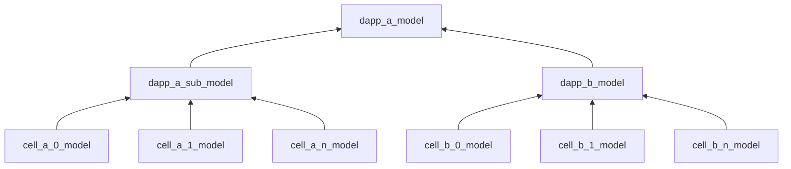

## Problems to solve

There are three obvious obstables hindering the development of DApps on CKB.

### First: separate runtimes

CKB adopts Cell model which is a generalization of UTXO model so only a **function of state verification** is running on-chain, that's the core of a DApp and theoretically that's all of a DApp.

But a real-word DApp is for users who are not good at mathematics or programming so the logic of the DApp will be exposed by a graphical interface and a set of prescribed actions. The team of a DApp has to 

  1. re-implement **function of state verification on-chain** off-chain for testing;
  2. define a **state transition equation** following the **function of state verification** for prescribed actions;
  3. define algorithms to get ideal parameters for the **state transition equation**, namely `input cells` from CKB, and implement a server to map kv data into relational data for graphical interface.

A mass of off-chain works are introduced because runtimes of on-chain and off-chain are separate and follow exclusive paradigms.

**function of state verification on-chain** is totally a pure function which returns code_0 for success and code_other for failure, all its arguments are determined so the result is predictable.

**function of state verification off-chain** is a rehearsal or replay of **function of state verification off-chain**, they share the same logic but the one off-chain may be re-implemented because the one on-chain is based on rust which is hard for most programmers.

**state transition equation** is reversed from the **function of state verification**, this is easy to understand and used in ethereum contract, 

```
// let's define the function of state verification and expect it be be 0
fn(action)(current_state, new_state) = 0

// then the state transition equation will be deduced
new_state = fn'(actions)(current_state)

// and we get the state transition function
const fn_transition = fn'(actions)
```

What's even crazy is that **state verification** is **functional** while **state transition** might be in **object-oriented** style because `actions` in `fn'(actions)` is from a set of pre-defined actions on graphical interface and could be pipelined in various order.

Besides, the **function of state transition** has only one parameter `current_state`, which is determined by algorithms of gathering cells on-chain, the algorithms will be realized by complex mechanism due to consideration of engineering and concurrency issues caused by cell model.

These concepts are too obscure and leading to a steep learning curve for DApp developers.

### Second: Lack of development paradigm

There's no clear and unified paradigm for development, every DApp project could have various assumptions, project structure, workflow, and APIs. By the variety, each DApp grows into an insulated island because it takes too much to understand the design, implementation of a DApp. It's also hard to interoperate another DApp because its APIs are unpredictable.

### Third: Fragmented devtools

Now there're many devtools for specific goals or domains but it takes too much to master them all.

#### Contract development
  - Capsule: https://github.com/nervosnetwork/capsule, a development framework for creating smart contract scripts in Rust for Nervos' CKB layer 1 blockchain. Capsule is designed to provide an out-of-the-box solution that helps Nervos developers accomplish common tasks quickly and painlessly.
  - CKB standalone debugger: https://github.com/nervosnetwork/ckb-standalone-debugger, a standalone debugger enabling off-chain contract development.

#### Local network
  - Tippy: https://github.com/nervosnetwork/tippy, tippy is a sandbox development environment available to Nervos CKB developers. Throughout the development cycle, developers can use Tippy, which allows them to develop, deploy and test DApps in a secure and deterministic environment.

#### Aggregation service
  - CKB Indexer: https://github.com/nervosnetwork/ckb-indexer,a standalone service for creating cell and transaction indexes as an alternate solution.
  - Lumos: https://github.com/ckb-js/lumos, lumos is a full-featured JavaScript/TypeScript based DApp framework for Nervos CKB.
  - Mercury: https://github.com/nervosnetwork/mercury, building on top of ckb-indexer, Mercury provides handy integration features for Nervos CKB.

What's worse, some DApp teams found the devtools were not enough for them so they had to develop tools for themselves, leading to more fragmented.

## How other ecologies are solving these problems

For the separate runtimes issue introduced by UTXO model, there's a framework named `run`(https://run.network/) aiming at propagating a token protocol for universal DApps.

A data model named `Jig` is brought in as the most basic unit of an interactive object to build a skyscraper from bricks. Imagine we are building a toy vehicle with lego blocks, every two blocks can be easily connected even they are in various shapes because they share a unified interface.


And all advanced data models are derived from `Jig`, like `Code`, `Token`, work for specific functions, can be connected to each other because they share the most basic interfaces.

_62cc2a188ab59.png)


In terms of development paradigm and devtools, ethereum community has given a good enough answer. The most popular development framework in ethereum community is `hardhat`(https://hardhat.org/), which names itself as **professional development environment** and is super similar to a mature build system.

It takes care of building/debugging/testing/deployment and is extensible by plugins and tasks so developers could finish their work within a framework.

By the support of hardhat, projects will follow the same convention and generate a contract-specific SDK for outside users.

## Kuai Project

`Kuai` project is a framework to solve problems mentioned above, inspired by [actor model](https://www.wikiwand.com/en/Actor_model), [run](https://run.network/), [hardhat](https://hardhat.org/) and other tools popular in the community.

`Kuai` includes a unified paradigm for development, a set of conventions, fine-grind all-in-one devtools with SDKs and a general aggregation service.

### Unified paradigm for development

Two abstractions will be promoted in `Kuai`: `Data storage` and `Data manipulation`

#### Abstraction of data storage

There'll be three basic data models used in `Kuai` based DApps: `Data`, `Code`, `MultiCoin Token`

##### Data

The basic function of cells in CKB is storing data. But data are meaningless without schema, so the first basic model introduced by `Kuai` is named `Data` which is used to transform plain data into a structured data with schema.

Note that a `Data` model could be a group of cells matching the same pattern and working as an entity so it could be regarded as a virutal DApp. Say we have 2 DApps in `School Roster Data` models, each of them consists of many `Student Data` models. And we are going to build a `Sports Meeting` DApp, a new `Sports Meeting Data` model could be created and consists of partial `Student Data` from School A and B respectively, it should work as same as a `School Roster` DApp.

##### Code

`Code` model is extended from `Data` model and used for scripts. A `Code` model has not only attributes, but also methods. In other words, it's not only read-/writable, but also executable. `Code` model's data/state could be updated by some rules rather than a simple `set` method inherited from the `Data` model.

##### MultiCoin Token

Token is a general use case that should have ability of transferring between DApps, so the third model to introduce is `MultiCoin Token`, which is specialized from `Code` model with specific attributes and methods.

#### Abstraction of data manipulation

DApps can read states from each other freely because data/states are arranged uniformly by the abstraction of data storage.

DApps can also communicate with each other freely if data manipulation has been abstracted.

##### Data

A `Data` model should have 7 basic interfaces

- New(pattern): create an `Data` model binding to specified cells, as a DApp located by the pattern, ps: it's a virtual DApp rather than an explicit DApp, but because cells are following the same rule, they can work together as an entity.
- Destroy(): remove state and turn the cells into empty
- Duplicate(): create a `Data` model from a instance
- Sync(blockNumber?): will load and update data from the chain at latest(or specific block) global state
- Get(path): will read value of specified path
- Set(path, value): will set given value at specified path
- Delete: (path): remove key/value at specified path

##### Code

A `Code` model should have 5 more interfaces than `Data` model

- Deploy(): deploy the script on the chain
- Extend(code): extends from an existing `Code` model for overriding
- Upgrade(): upgrade the script on the chain
- Run(method: string, params: Array<any>): call a method of the script to update its state
- Link(abi: Array<object>): instantiate a script SDK from ABI

##### MultiCoin Token

A generally used token must have some methods based on `Code`

- Metadata(tokenId, metadata?): a setter/getter to the metadata of a specific token id including `name`, `symbol`, `tokenURI`, `totalSupply`)
- Mint(tokenId, amount): Mint a token
- Send(from, to, tokenId, amount): Send a token
- Stake(address, dapp, tokenId, amount, locktime?): stake into a dapp and get staking tokens
- Redeem(address, dapp, tokenId, amount): unstake from a dapp and burn a staking token
- Lock(address, amount, tokenId, locktime): lock tokens, for cases like pre-sale, bounty of a team
- Unlock(address, tokenId, amount): unlock tokens
- Combine(token): combine two `MultiCoin Token` models into one
- GetBalance(address, tokenId): get token balance of a given address


Notice, all actions will be grouped and finalized together, viz. `mint`/`send` multiple token id will be finalized with a single transaction

#### Reactive Lazy Evaluation

As mentioned above

> Notice, all actions will be grouped and finalized together, viz. `mint`/`send` multiple token id will be finalized with a single transaction

All actions/manipulations adopted on a model will be cached and evaluated at the end of the pipeline.

```javascript
const model = new Data()
model.action_1()
model.action_2()
// ...
modeol.action_n()

/**
 * get a structure with initial state and actions
 *
 * {
 *   state,
 *   actions: [action_1, action_2, action_3, ..., action_n]
 * }
 * 
 * and calling the finalize() to evaluate new state
 */

model.finalize()

/**
 *
 * {
 *   state: new_state,
 *   actions: [],
 * }
 *
 */

```

Lazy evaluation is beneficial to the following points:

1. state of the model could be traversed for debugging
2. actions could be revoked easily to find the best path of state transition.
3. inspector(or other dependencies) could be injected to enhance development

#### Model Tree

There would be multiple levels of `Data` models constructing a model tree.

Every cell on CKB could be treated as a DApp because every cell has its own state and script while a group of cells using the same script should also be treated as a DApp because they adopt the same logic on a broader state.

Besides, if a DApp_A wants to interact with another DApp_B, stateof DApp_B would be a part of DApp_A's state so the models would be like



### Conventions

`Kuai-convention` is a set of conventions for the implementation reference of `Kuai-runtime` and the usage guide of `Kuai-runtime`, such as:

- serialization - cell state layout to prevent conflict between different contract interactions
- ABI - Application Binary Interface for cell model
- structure - project structure
- sequencer - define how to sort (aggregate) user requests
- storage - A series of schemes on how to persist data, such as serialization schemes, etc.

### Fine-grind devtools

The paradigm and conventions will be instructed by `Kuai` with a fine-grind devtool named `Kuai-runtime`, similar to nx(https://nx.dev/) which provides basic features of a build system and extensible for tasks and plugins.

Basic features delivered by `Kuai` build system:
  - Clear project structure
  - Compile
    - Debug
    - Release
  - Debug
    - Break point
    - Console
    - Inspector
  - Test
    - Run specific cases
    - Generate a mock transaction
    - Helpers as clear state, rollback
  - Deployment
  - Configuration management
    - Multiple network
    - Hd wallet
  - Base contracts/scripts

Possibly included tasks/plugins are as follow:
  - cycle reporter
  - script sizer
  - test-coverage
  - document
  - debugger remover
  - typechain: https://github.com/dethcrypto/TypeChain/
  - storage layout: https://www.npmjs.com/package/hardhat-storage-layout, when to use on-chain/off-chain data

`Kuai-runtime` covers on-chain and off-chain parts of a project, implements the interface defined by `Kuai-convention`, shielding implementation details and provides easy-to-use APIs.

`Kuai-runtime` also provides friendly libraries/modules for building, sending, and managing transactions, which will be elaborated on in section `General aggregation service`.

### General aggregation service

Now there are two classic types of DApp running on CKB
1. based on the general cell model: e.g. Force Bridge, Portal Wallet...
2. based on the SMT(sparse merkle tree, https://github.com/nervosnetwork/sparse-merkle-tree) half-rollup like: e.g. CoTA NFT, dotbit, sub-accounting...

`Kuai`'s aggregation service would cover these two cases for general usages and has following components:

- Merkle X Storage  - Generate proof which stored in on-chain. And persist data in off-chain.
- Sequencer - Combine multiple requests into one to avoid [concurrency issue](https://iohk.io/en/blog/posts/2021/09/10/concurrency-and-all-that-cardano-smart-contracts-and-the-eutxo-model/).
- Transaction Builder Factory (OnChainStateUpdator) - Build transactions that update on-chain state.
- CkbNodeClient - Interact with chains, such as query transaction status, etc.
- Client-side SDK - Common wallet integration, e.g MetaMask(sign via EIP712 if possible), TronLink, CardanoWallet…
- Scheduler - Scheduling various sub-services, such as Sequencer and Merkle X Storage.


The aggregation service would run as a sub module in DApp's server


## Website

Last but not least, as an open source project, `Kuai` would be introduced to developers with good documentation and rich examples, including:
- Tutorials
- Developer Documentation
- API documentation

## Roadmap
- M1 ~ M2
  - Construct a build system similar to https://nx.dev/, only for project structure, basic tasks, and plugins
  - Design storage paradigm
  - Design action paradigm
  - Design workflow with base contracts/scripts
- M3 ~ M4
  - Implements SDK following the designed paradigm and workflow with base contracts/scripts
  - Design generally used tasks and plugins
      - Cycle reporter
      - Script sizer
      - Test-coverage
      - Document
      - Debugger remover
      - Typechain: https://github.com/dethcrypto/TypeChain/
      - Storage layout: https://www.npmjs.com/package/hardhat-storage-layout, when to use on-chain/off-chain data
  - Design local network debug/test/deploy tools
- M5
  - Implement tasks/plugins
  - Implement local network
  - Implement debug/test/deploy tools
- M6
  - Use the project to deliver a simple .bit dapp

